# Account setup

**This only needs tyo be done by once per account. If you are sharing an account, whoever is nominated to carry out these instructions, please share the details with yuor team.**

Because we're using some advanced functionality for todays workshop, we need to configure a couple of steps manually

## 1. Create the AWS CodeCommit repository

In this step we are going to create an AWS CodeCommit repository for collaboration with the [**JubyterLab-git extension**](https://github.com/jupyterlab/jupyterlab-git) that has recently been added to Amazon SageMaker, and the make it accessible for all Amazon SageMaker users within the account.

### High-Level Instructions

Use the console or AWS CLI to create an AWS CodeCommit repository called `SageMakerCollaboration`, then go to the Amazon SageMaker service in the console and add it as a git repository.

(see step-by-step instructions below if you are unfamiliar with this process).

<details>
<summary><strong>Step-by-step instructions (expand for details)</strong></summary><p>

1. Make sure you are on the AWS Management Console home page.  In the **Find Services** search box, type **CodeCommit**.  The search result list will populate with CodeCommit, which you should now click.  This will bring you to the AWS CodeCommit console homepage.

1. Press the **Create Repository** button
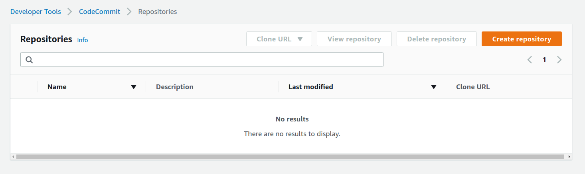

1. Enter the name `SageMakerCollaboration` as the repository name, and click **Next**
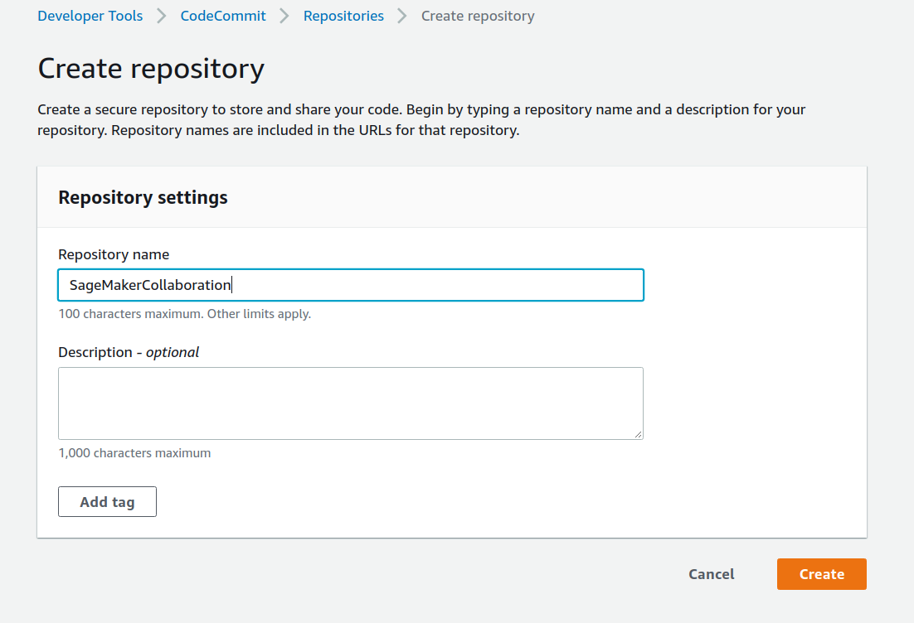

1. Your repository will be created, and you will see the connections information. You can ignore this as we will be working within the Amazon SageMaker environment, using the permissions that you created in the previous step.
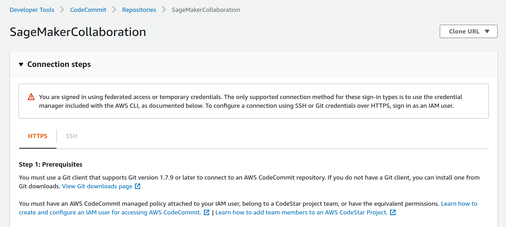

1. Scroll to the bottom of the page and click the **Create File** button
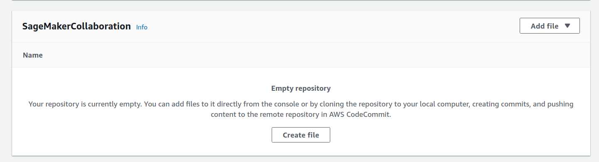

1. For the contents of the file, put `# SageMaker collaboration demo`
1. For the filename, use README.md
1. Add your name and email address
1. Add a commit message, like `Initial commit`
1. Click **Commit Changes**
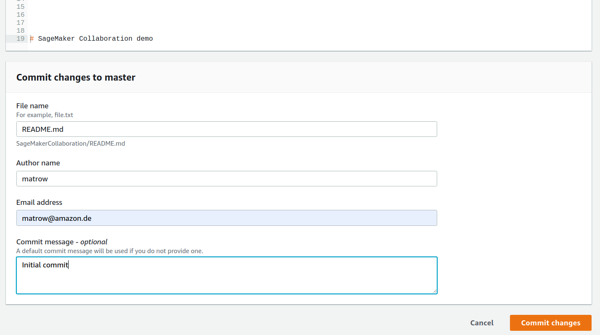

1. You will see your newly committed file rendered for you
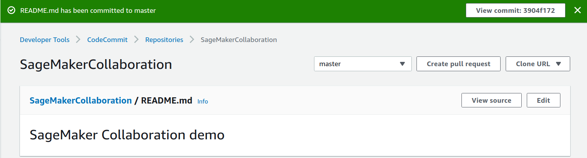 

1. Create another file called `.gitignore` in the same way, with the contents `.ipynb_checkpoints`. This will prevent you from comitting your own checkpoints and clashing with other collaborators.

1. In the Services menu, type SageMaker and browse to the Amazon SageMaker console.

1. From the left hand menu select **Git repositories**
1. You will see a list of your added repositories, possibly empty
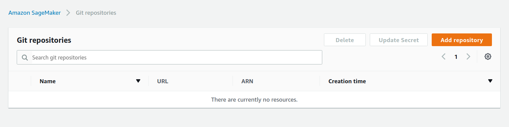
1. Click **Add repository**
1. Make sure that CodeCommit is selected. For a detailed walkthrough of adding a github repository please follow this how to.

1. Select the SageMakerCollaboration repo, and the master branch
1. You can choose to give it a shorter alias if you wish, or stick with `SageMakerCollaboration`
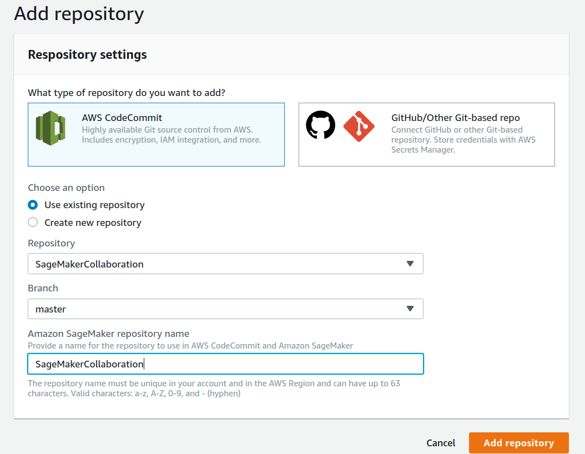
1. Click **Add repository**
1. You will see the confirmation that the `SageMakerCollaboration` repository has been made available to all users of Amazon SageMaker.
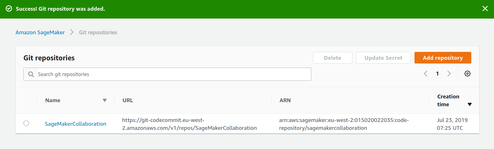

</p></details>

## 2. Create the Amazon SageMaker LifeCycle Configuration

In this step we are going to create an Amazon SageMaker LifeCycle Configuration, custom functionality that can be shared across all instances of Amazon SageMaker.
There are 2 lifecycle events you can hook into, Instance Creation, and Instance Launch. 

[**There are all kinds of actions**](https://aws.amazon.com/blogs/machine-learning/how-to-use-common-workflows-on-amazon-sagemaker-notebook-instances/) that you can script, such as 

    - Mount an EFS share for your Home directory
    - Pull data from S3
    - Archive your work via a CRON schedule to S3
    - Pull a repo

Or even [**disable internet access to your instances**](https://aws.amazon.com/blogs/machine-learning/customize-your-amazon-sagemaker-notebook-instances-with-lifecycle-configurations-and-the-option-to-disable-internet-access/)

### High-Level Instructions

Use the console or AWS CLI to create an Amazon SageMaker lifecycle configuration to clone a repo on instance creation, and update jupyterlab on start.

(see step-by-step instructions below to complete this process).

<details>
<summary><strong>Step-by-step instructions (expand for details)</strong></summary><p>

1. Click on **Lifecycle configurations** from the left hand menu, and you will be taken to the list of available Configurations. This could be empty.
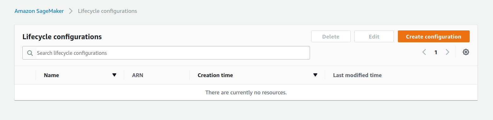
1. Click on **Create configuration**
1. For **name** enter `SageMakerLCCDemo`
1. Whilst the **Start notebook** tab is selected, enter
```
#!/bin/bash

set -e

pip install --upgrade jupyterlab
pip install --upgrade jupyterlab-git
```
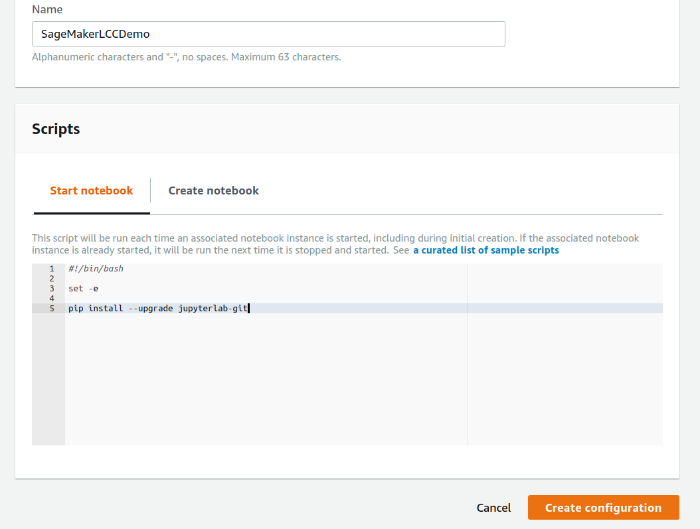
1. Click to the **Create notebook** tab
1. All repos are added under the path `/home/ec2-user/SageMaker`
1. Add the following code

```
#!/bin/bash

set -e

cd /home/ec2-user/SageMaker
git clone https://github.com/podulator/amazon-sagemaker-workshop.git
cd amazon-sagemaker-workshop
git checkout dh
cd ../
sudo chmod -R a+w ./amazon-sagemaker-workshop/
```
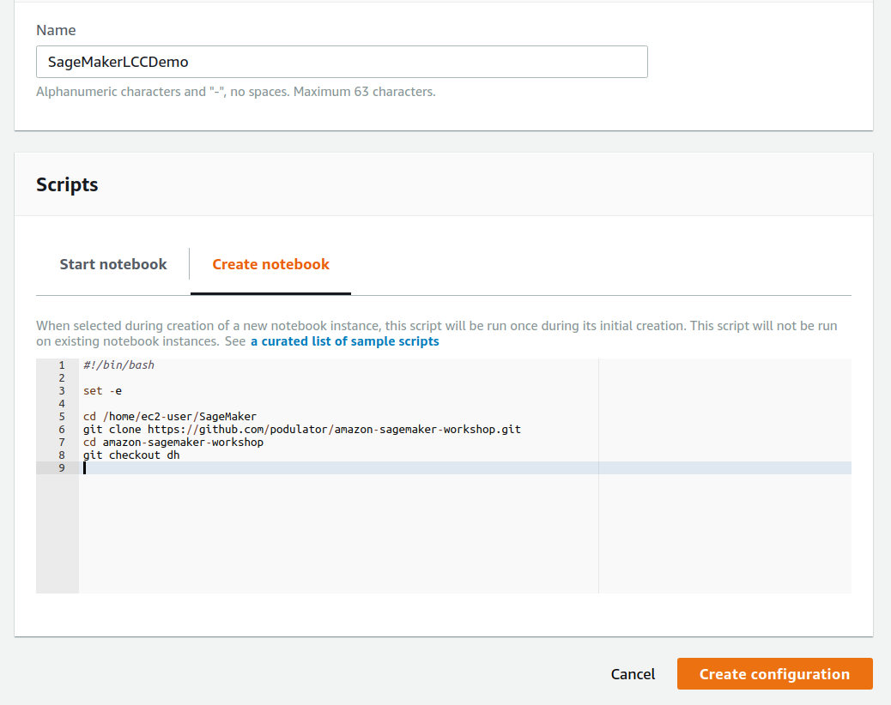

1. Click on **Create configuration**, and you will be taken back to the list of Configurations, with your new one shown.

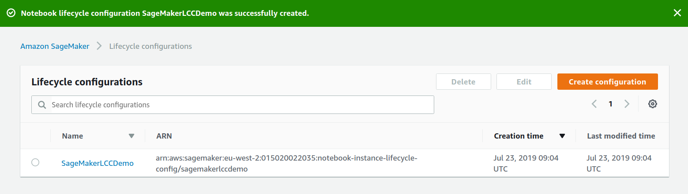

</p></details>

Congratulations, your account is all set up, and you're ready for you and your team to launch your own Amazon SageMaker instances.

[**Return to the instructions**](../README.md)
