# Creating a Notebook Instance

## Configure the Notebook Instance

1. Make sure you are on the AWS Management Console home page.  
In the **Find Services** search box, type **SageMaker**.  The search result list will populate with Amazon SageMaker, which you should now click.  This will bring you to the Amazon SageMaker console homepage.

2. In the upper-right corner of the AWS Management Console, confirm you are in the desired AWS region.

3. To create a new notebook instance, click the **Notebook instances** link on the left side, and click the **Create notebook instance** button in the upper right corner of the browser window.

4. Type smworkshop-[First Name]-[Last Name] into the **Notebook instance name** text box, and select ml.m5.xlarge for the **Notebook instance type**.

5. Expand the Advanced configuration section, and select the **SageMakerLCCDemo** Lifecycle configuration created earlier.

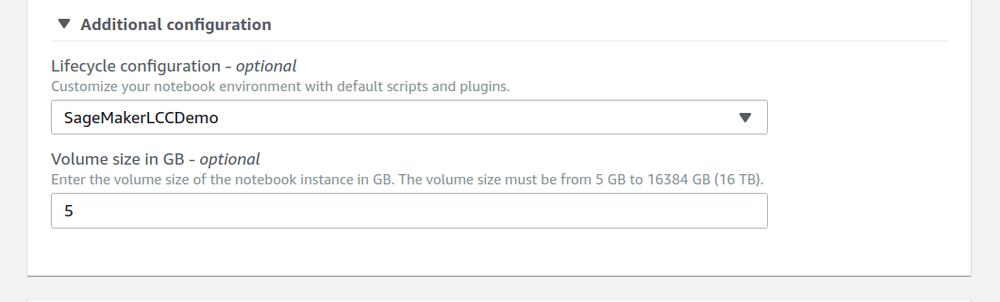

6. In the **Permissions and encryption** section, choose **Create a new role** in the **IAM role** drop down menu.  

In the resulting pop-up modal, select **None** under **S3 Buckets you specify – optional**. 
We will use the default bucket that SageMaker creates for us, which is allowed by the permissions list with the green ticks next to them, 
basically, anything with 'sagemaker' in the name or as a tag.

Click **Create role**.

7. When you get the success message, click on the link for the new role, probably starting with `AmazonSageMaker-ExecutionRole-` which will take you to the role permissions in a new tab.

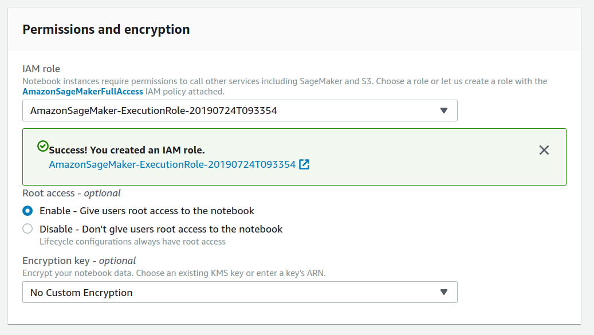

8. On the Role summary page, click the **Attach policies** button

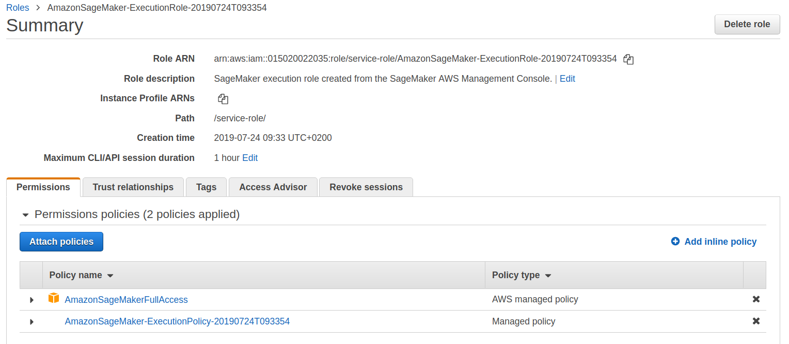

9. In the filter box type `codecommit` and it will filter the list of available policies. 

10. Select AwsCodeCommitPowerUser and click **Attach Policy**

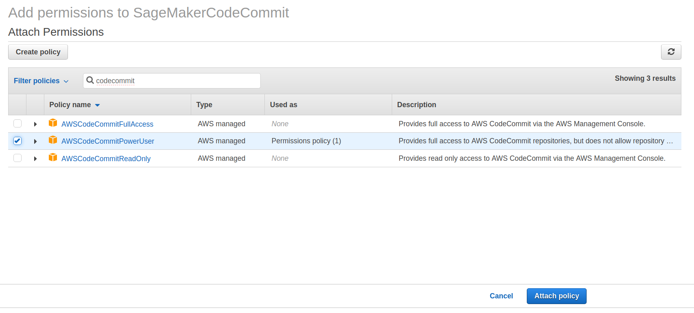

11. You will be taken back to the summary page, with a confirmation that the policy has been attached. You can now close this tab.

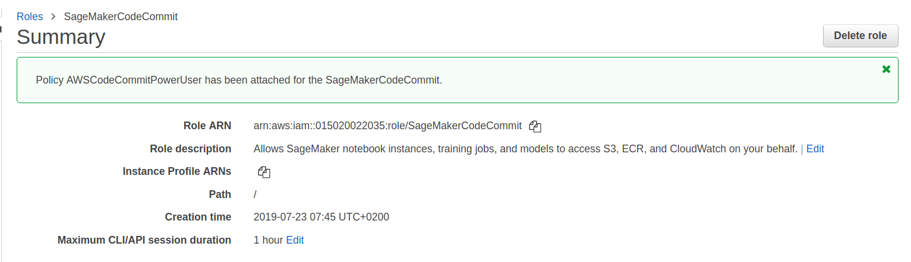

12. Expand out the optional **Git repositories** section. Select the previously created SageMakerCollaboration CodeCommit repository for the Default repository

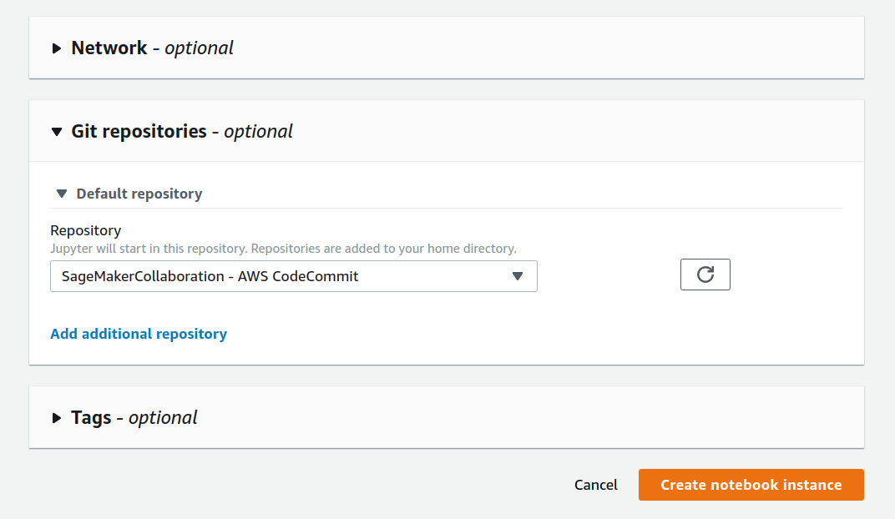

13. Click **Create notebook instance**. You will be taken to the list of instances, showing your newly created one in the **Pending** state.

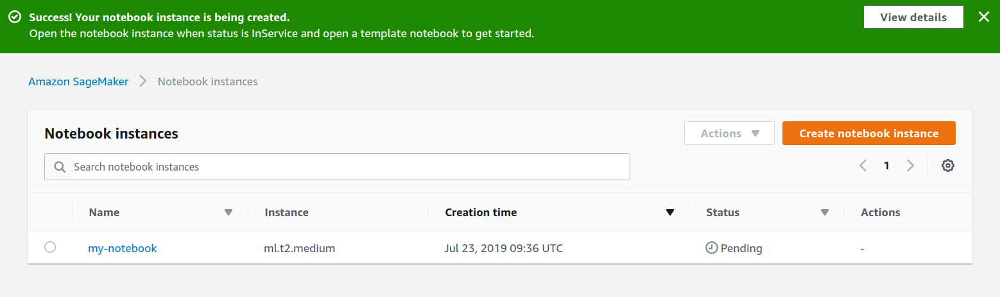

14. Wait for your Instance to be fully created. The status will say **InService**.

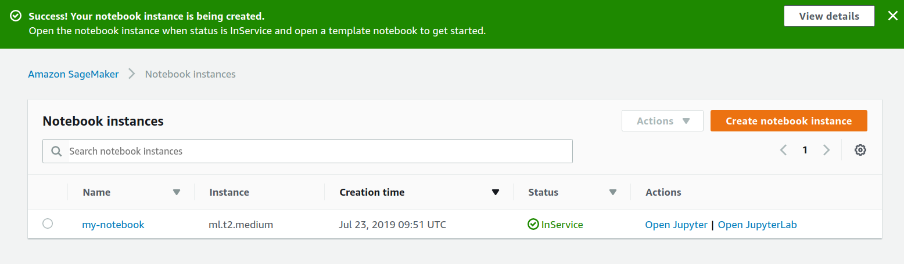

15. Click on your Notebook Instances' name, and you will be taken to its settings page

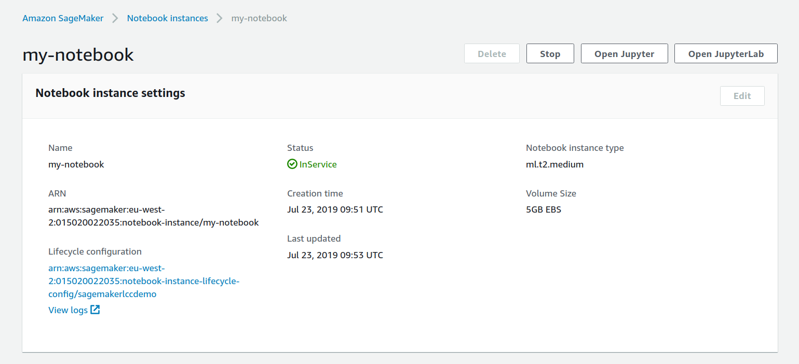

16. Click on the **View Logs** Link

17. The launch logs will open in a new tab. Have a look at the logs for the LifeCycle hooks

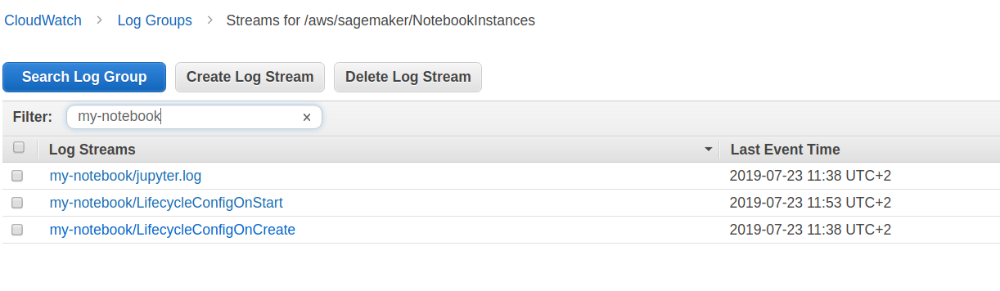

18. Close the Logs tab in your browser

19. Click the Open Jupyter Lab button, and let the interface open in a new tab. You will see that it opens to your CodeCommit default repository

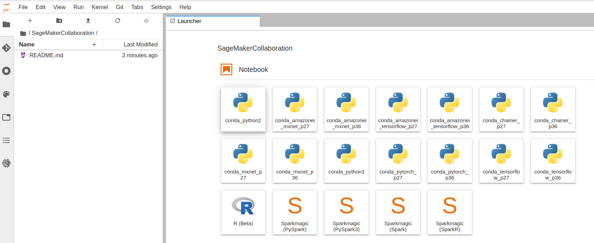

20. Click on the README.md file in the directory browser. Edit the file, add your name or similar, and save the file (ctrl + s) 

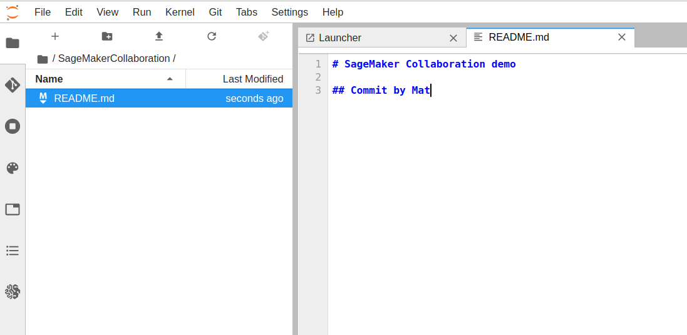

21. Click the Git icon in the left hand pane. You will see that the README.md file is marked as changed.

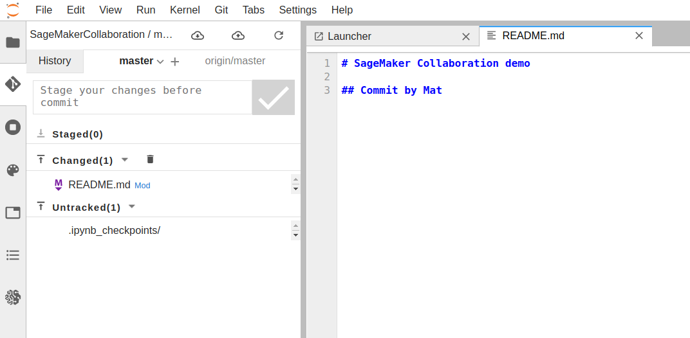

22. Right click the README.md file, and click **Satge**

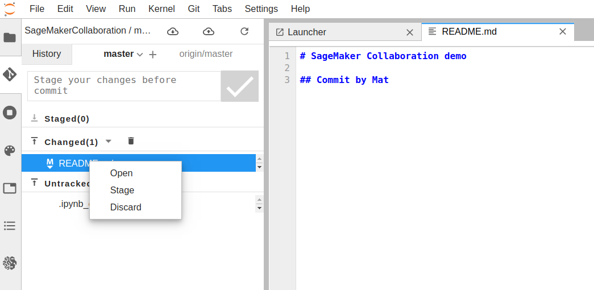

23. The file is now ready to be comitted. Enter a commit message and save it.

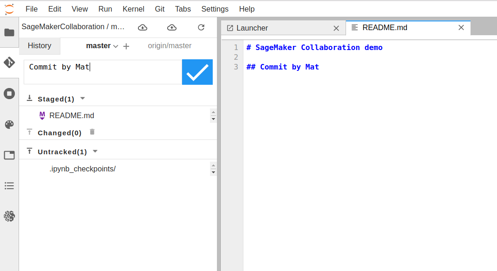

24. Finally, push the file using the Push icon. (Cloud and up arrow)

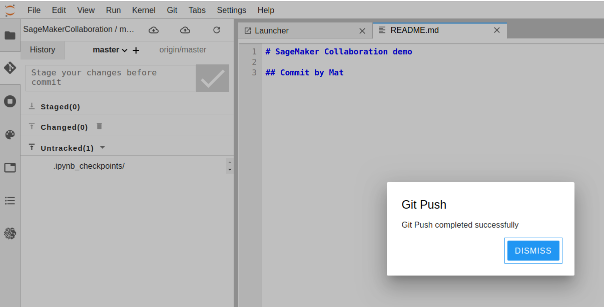

25. Clost the JupyterLab tab, so you are back at the Amazon SageMaker interface.

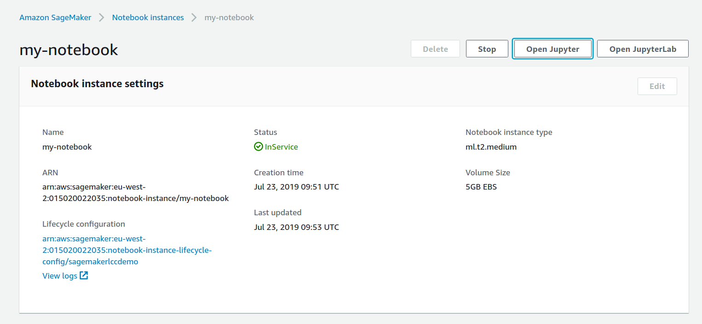

26. Click the **Open Jupyter** button to launch the labs. Click to the root folder so you can see both repositories.

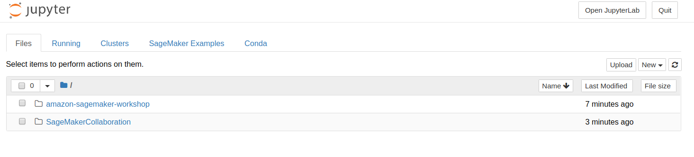

27. Click into the amazon-sagemaker-workshop directory, and you are ready to start the labs

[**Return to the instructions**](../README.md)
