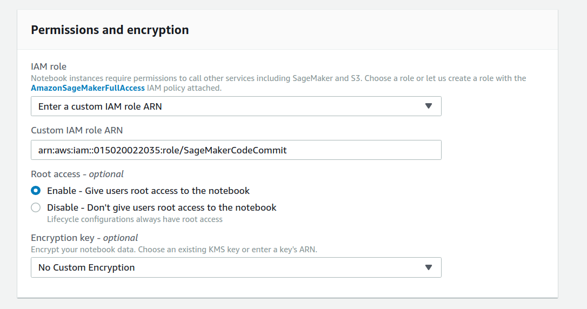

# Creating a Notebook Instance

## Configure the Notebook Instance

1. Make sure you are on the AWS Management Console home page.  
In the **Find Services** search box, type **SageMaker**.  The search result list will populate with Amazon SageMaker, which you should now click.  This will bring you to the Amazon SageMaker console homepage.

2. In the upper-right corner of the AWS Management Console, confirm you are in the desired AWS region.

3. To create a new notebook instance, click the **Notebook instances** link on the left side, and click the **Create notebook instance** button in the upper right corner of the browser window.

4. Type smworkshop-[First Name]-[Last Name] into the **Notebook instance name** text box, and select ml.m5.xlarge for the **Notebook instance type**.

5. Expand the Advanced configuration section, and select the **SageMakerLCCDemo** Lifecycle configuration created earlier.

6. In the **Permissions and encryption** section
    - select **Enter a custom IAM Role ARN**
    - Paste in the Role ARN that was created earlier, in the Setting up your account section

7. Expand out the optional **Git repositories** section. Select the previously created SageMakerCollaboration CodeCommit repository for the Default repository

8. Click **Create notebook instance**. You will be taken to the list of instances, showing your newly created one in the **Pending** state.

9. Wait for your Instance to be fully created. The status will say **InService**.

10. Click on your Notebook Instances' name, and you will be taken to its settings page

11. Click on the **View Logs** Link

12. The launch logs will open in a new tab. Have a look at the logs for the LifeCycle hooks

13. Close the Logs tab in your browser

14. Click the Open Jupyter Lab button, and let the interface open in a new tab. You will see that it opens to your CodeCommit default repository

15. Click on the README.md file in the directory browser. Edit the file, add your name or similar, and save the file (ctrl + s) 

16. Click the Git icon in the left hand pane. You will see that the README.md file is marked as changed.

17. Right click the README.md file, and click **Satge**

18. The file is now ready to be comitted. Enter a commit message and save it.

19. Finally, push the file using the Push icon. (Cloud and up arrow)

20. Clost the JupyterLab tab, so you are back at the Amazon SageMaker interface.

21. Click the **Open Jupyter** button to launch the labs. Click to the root folder so you can see both repositories.

22. Click into the amazon-sagemaker-workshop directory, and you are ready to start the labs

[**Return to the instructions**](../README.md)
