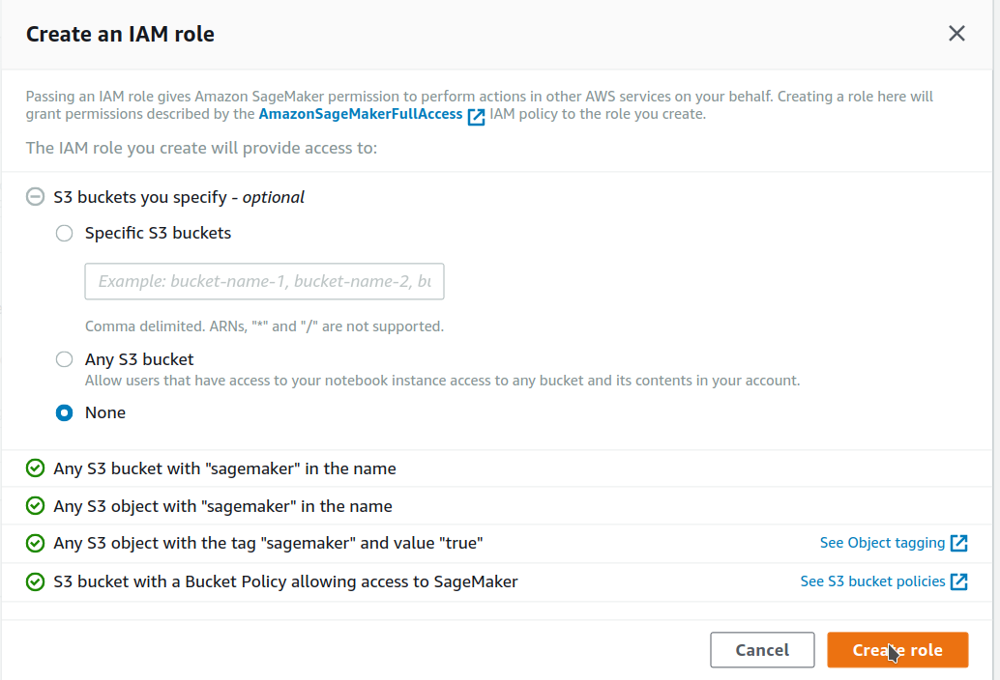
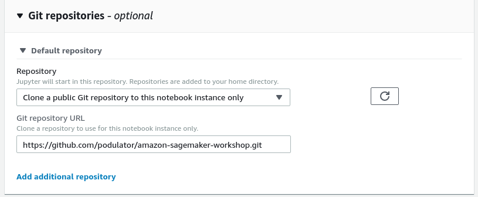

# Creating a Notebook Instance

We'll start by creating an Amazon S3 bucket that will be used throughout the workshops.  We'll then create a SageMaker notebook instance, which we will use for the other workshop modules.

## 1. Create a S3 Bucket

SageMaker typically uses S3 as storage for data and model artifacts.  In this step you'll create a S3 bucket for this purpose. To begin, sign into the AWS Management Console, https://console.aws.amazon.com/.

### High-Level Instructions

Use the console or AWS CLI to create an Amazon S3 bucket (see step-by-step instructions below if you are unfamiliar with this process). Keep in mind that your bucket's name must be globally unique across all regions and customers. We recommend using a name like `smworkshop-firstname-lastname`. If you get an error that your bucket name already exists, try adding additional numbers or characters until you find an unused name.

<strong>Step-by-step instructions (expand for details)</strong>

1. In the AWS Management Console, choose **Services** then select **S3** under Storage.

1. Choose **+Create Bucket**

1. Provide a globally unique name for your bucket such as `smworkshop-firstname-lastname`.

1. Select the Region you've chosen to use for this workshop from the dropdown.

1. Choose **Create** in the lower left of the dialog without selecting a bucket to copy settings from.

## 2. Launching the Notebook Instance

1. Make sure you are on the AWS Management Console home page.  In the **Find Services** search box, type **SageMaker**.  The search result list will populate with Amazon SageMaker, which you should now click.  This will bring you to the Amazon SageMaker console homepage.

2. In the upper-right corner of the AWS Management Console, confirm you are in the desired AWS region. Select Oregon.

3. To create a new notebook instance, click the **Notebook instances** link on the left side, and click the **Create notebook instance** button in the upper right corner of the browser window.

4. Type smworkshop-[First Name]-[Last Name] into the **Notebook instance name** text box, and select ml.m5.xlarge for the **Notebook instance type**.

5. In the **Permissions and encryption** section, choose **Create a new role** in the **IAM role** drop down menu.  

In the resulting pop-up modal, select **None** under **S3 Buckets you specify – optional**. 
We will use the default bucket that SageMaker creates for us, which is allowed by the permissions list with the green ticks next to them, 
basically, anything with 'sagemaker' in the name or as a tag.

Click **Create role**.

6. Expand out the optional **Git repositories** section
-  Select 'Clone a public Git repository to this notebook instance only'
-  For the Git Repository URL, enter this repositories address
    - Open the home page of this GitHub repository in another tab
    - Click the green **Clone or download** button from the upper right of the main page of the repository
    - Copy the https url, `https://github.com/podulator/amazon-sagemaker-workshop.git`
    - Paste it into the Git Repository URL field
- Now your instance will launch with the latest version of these workshops already on it, in a folder called `amazon-sagemaker-workshop`

7. You will be taken back to the Create Notebook instance page.  Now you should see a message saying "Success! You created an IAM role."

8. Click **Create notebook instance** at the bottom.

### 3. Accessing the Notebook Instance

1. Wait for the server status to change to **InService**. This will take several minutes, possibly up to ten but likely much less.

2. Click **Open Jupyter**. You will now see the Jupyter homepage for your notebook instance.

[**Return to the instructions**](../README.md)
